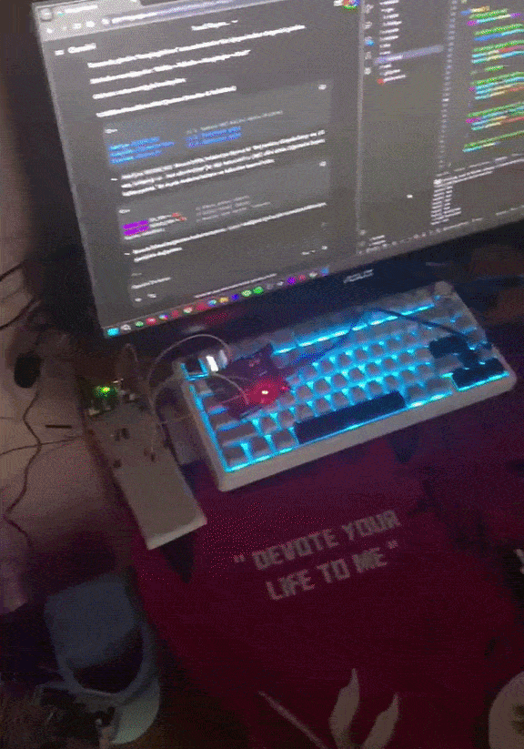

# 🔌 IR Remote-Controlled Light Switch Automation Mechanism

An embedded system prototype developed with **C++** and **PlatformIO** that enables remote physical switch actuation using Infrared (IR) signals and a servo motor mechanism.

---

## 📹 Demonstration (GIF)



---

## 🛠️ Technical Overview

* **Programming Language:** C++ (Embedded Systems)
* **Development Environment:** VS Code & PlatformIO
* **Core Components:**
  * Microcontroller (Arduino / ESP32 framework)
  * Infrared (IR) Receiver Module (NEC Protocol)
  * Servo Motor (SG90)
  * Physical Light Switch Trigger Mechanism

---

## 💡 Key Features & Logic

1. **Signal Decoding:** Decodes raw Hex signals received from an IR remote controller using the `IRremote` protocol.
2. **Servo Control & Mechanical Actuation:** Maps valid IR command codes to precise angular movement (`SERVO_PRESS_ANGLE`) to physically flip the wall switch button.
3. **Automatic Reset:** Resets the servo back to its default idle position (`SERVO_REST_ANGLE`) to prepare for the next command.

---

## 🚀 How to Run

1. Clone this repository:
   ```bash
   git clone [https://github.com/Yusufzckr/IR-Switch-Automation-Embedded.git](https://github.com/Yusufzckr/IR-Switch-Automation-Embedded.git)
